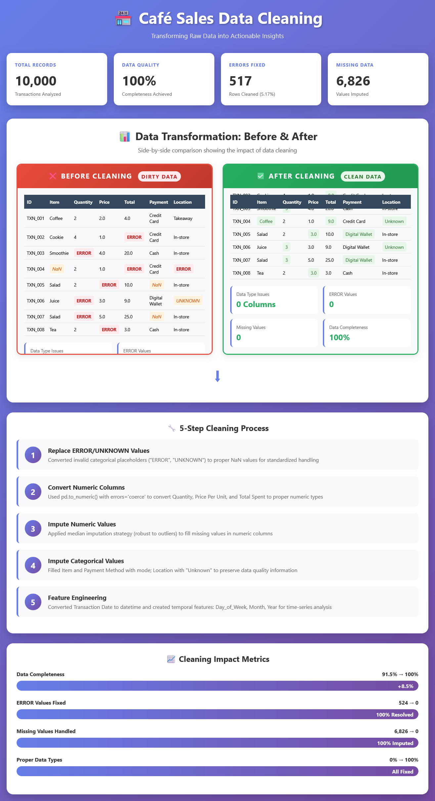
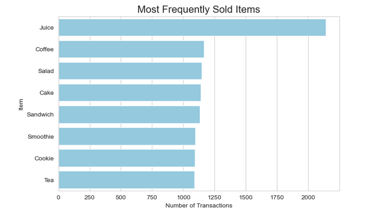
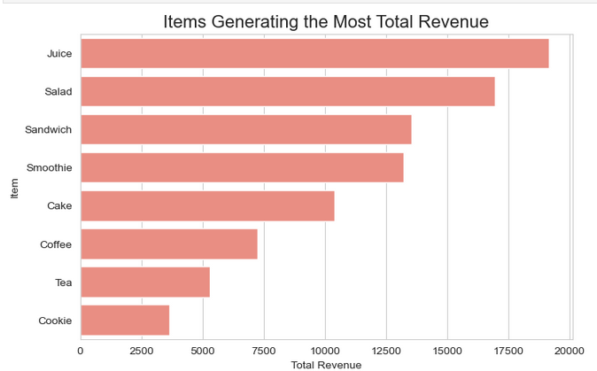
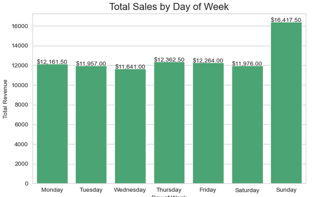
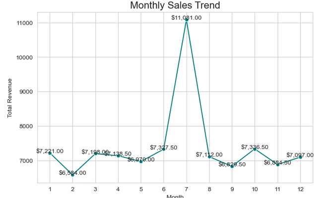
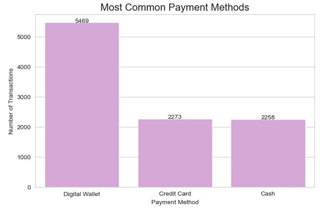
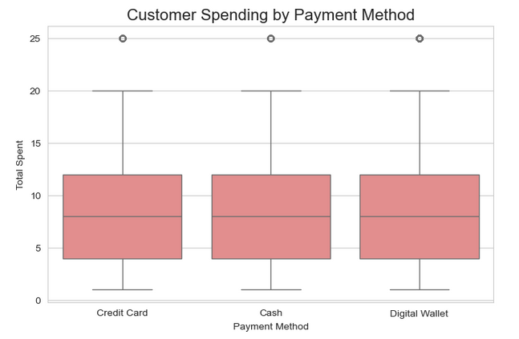

# 🏪 Café Sales Data Cleaning & Analysis Project

[](https://www.python.org/downloads/)
[](LICENSE)
[](/)
[](https://www.kaggle.com)

A comprehensive data cleaning and exploratory data analysis (EDA) project transforming dirty café sales data into actionable business insights. This project demonstrates professional data science workflows, from handling missing values and ERROR entries to uncovering revenue patterns and customer behavior.

---

## 📊 Project Overview

This project analyzes **10,000 café sales transactions** from 2023, addressing significant data quality challenges and extracting valuable business intelligence through systematic cleaning and statistical analysis.

### Key Achievements
- ✅ **100% Data Completeness** - Successfully cleaned 517 rows with ERROR values (5.17%)
- 📈 **Revenue Insights** - Identified Juice as top performer ($18,972, 21.84% of revenue)
- 📅 **Temporal Patterns** - Discovered Sunday generates 32% premium ($16,417.50)
- 💳 **Customer Behavior** - Revealed Digital Wallet dominance (54.69% of transactions)
- 🎯 **Strategic Recommendations** - Delivered 15+ actionable business recommendations

---

## 🎨 Interactive Data Cleaning Visualization

### Before & After Comparison



> **Interactive Demo**: Open `data_cleaning_visualization.html` in your browser to see the animated before/after comparison!

<table>
<tr>
<td width="50%">

### ❌ Before Cleaning
- **Data Type Issues**: All columns stored as objects
- **ERROR Values**: 524 instances across numeric columns
- **Missing Data**: 6,826 missing values (31.4%)
- **Invalid Entries**: "ERROR", "UNKNOWN", NaN placeholders
- **Data Completeness**: 91.5%

</td>
<td width="50%">

### ✅ After Cleaning
- **Data Type Issues**: ✓ All proper types (numeric, datetime)
- **ERROR Values**: ✓ 0 instances (100% resolved)
- **Missing Data**: ✓ 0 missing values (intelligent imputation)
- **Invalid Entries**: ✓ All converted/replaced appropriately
- **Data Completeness**: ✓ 100%

</td>
</tr>
</table>

---

## 📁 Project Structure

```
cafe-sales-analysis/
│
├── data/
│   ├── cafe_sales_dirty.csv          # Original dirty dataset
│   └── cafe_sales_cleaned.csv        # Cleaned dataset (output)
│
├── notebooks/
│   └── cafe_sales_project.ipynb      # Main analysis notebook
│
├── reports/
│   └── Cafe_Sales_Complete_Analysis_Report.docx  # Professional report
│
├── visualizations/
│   ├── data_cleaning_visualization.html          # Interactive before/after
│   ├── product_frequency.png                     # Product sales chart
│   ├── revenue_by_item.png                       # Revenue analysis
│   ├── daily_sales_pattern.png                   # Day of week trends
│   ├── monthly_sales_trend.png                   # Monthly patterns
│   ├── payment_method_distribution.png           # Payment preferences
│   └── spending_by_payment.png                   # Spending behavior
│
├── src/
│   ├── data_cleaning.py              # Cleaning functions
│   └── analysis.py                   # Analysis utilities
│
├── README.md                          # This file
├── requirements.txt                   # Python dependencies
└── LICENSE                            # MIT License
```

---

## 🚀 Quick Start

### Prerequisites
- Python 3.8+
- Jupyter Notebook
- Git

### Installation

1. **Clone the repository**
```bash
git clone https://github.com/EngIbrah/cafe-sales-analysis.git
cd cafe-sales-analysis
```

2. **Create virtual environment**
```bash
python -m venv venv
source venv/bin/activate  # On Windows: venv\Scripts\activate
```

3. **Install dependencies**
```bash
pip install -r requirements.txt
```

4. **Launch Jupyter Notebook**
```bash
jupyter notebook notebooks/cafe_sales_project.ipynb
```

5. **View Interactive Visualization**
```bash
# Open in browser
open visualizations/data_cleaning_visualization.html
```

---

## 🧹 Data Cleaning Methodology

### 5-Step Cleaning Process

#### **Step 1: Handle Categorical Errors**
Replace invalid placeholders ("ERROR", "UNKNOWN") with proper NaN values.

```python
df = df.replace(['ERROR', 'UNKNOWN'], pd.NA)
```

**Impact**: Standardized missing value representation across 6,826 values

---

#### **Step 2: Convert Numeric Columns**
Transform object-type columns to proper numeric types.

```python
numeric_cols = ['Quantity', 'Price Per Unit', 'Total Spent']
for col in numeric_cols:
    df[col] = pd.to_numeric(df[col], errors='coerce')
```

**Impact**: Enabled mathematical operations on 524 previously invalid values

---

#### **Step 3: Impute Numeric Values**
Apply median imputation (robust to outliers).

```python
df[numeric_cols] = df[numeric_cols].fillna(df[numeric_cols].median())
```

**Impact**: Filled 524 missing numeric values while preserving distribution

---

#### **Step 4: Impute Categorical Values**
Fill categorical columns with mode or contextual placeholders.

```python
cat_cols = ['Item', 'Payment Method']
for col in cat_cols:
    df[col] = df[col].fillna(df[col].mode()[0])

df['Location'] = df['Location'].fillna('Unknown')
```

**Impact**: Resolved 6,302 missing categorical values

---

#### **Step 5: Feature Engineering**
Create temporal features for time-series analysis.

```python
df['Transaction Date'] = pd.to_datetime(df['Transaction Date'], errors='coerce')
df['Day_of_Week'] = df['Transaction Date'].dt.day_name()
df['Month'] = df['Transaction Date'].dt.month
df['Year'] = df['Transaction Date'].dt.year
```

**Impact**: Enabled daily and monthly pattern analysis

---

## 📊 Key Findings & Visualizations

### 1. Product Performance Analysis

#### Most Frequently Sold Items


| Rank | Item | Transactions | % of Total | Market Share |
|------|------|--------------|------------|--------------|
| 🥇 | **Juice** | 2,140 | 21.40% | Top Seller |
| 🥈 | Coffee | 1,165 | 11.65% | Strong Performer |
| 🥉 | Salad | 1,148 | 11.48% | Strong Performer |
| 4 | Cake | 1,139 | 11.39% | Consistent Seller |
| 5 | Sandwich | 1,131 | 11.31% | Consistent Seller |

**Key Insight**: Juice dominates with 21.4% of all transactions, nearly double the next item.

---

#### Revenue Generation


| Rank | Item | Total Revenue | % of Total | Avg Price |
|------|------|---------------|------------|-----------|
| 🥇 | **Juice** | $18,972.00 | 21.84% | $8.87 |
| 🥈 | **Salad** | $17,021.00 | 19.59% | $14.83 |
| 🥉 | Sandwich | $13,484.00 | 15.52% | $11.92 |
| 4 | Smoothie | $13,132.00 | 15.11% | $11.98 |
| 5 | Cake | $10,341.00 | 11.90% | $9.08 |

**Key Insight**: Salad ranks 3rd in volume but 2nd in revenue due to higher average price ($14.83).

---

### 2. Time-Based Patterns

#### Daily Sales Analysis


| Day | Total Revenue | % of Weekly | vs Average | Performance |
|-----|---------------|-------------|------------|-------------|
| **Sunday** | **$16,417.50** | **17.49%** | **+32.0%** | 🔥 Peak Day |
| Thursday | $12,362.50 | 13.17% | -0.5% | ✅ Above Average |
| Friday | $12,264.00 | 13.07% | -1.3% | ✅ Above Average |
| Monday | $12,161.50 | 12.96% | -2.1% | ➡️ Average |
| Wednesday | $11,641.00 | 12.40% | -6.4% | ⚠️ Below Average |

**Key Insight**: Sunday generates $16,417.50 (32% above average), indicating strong weekend traffic.

---

#### Monthly Sales Trends


| Month | Revenue | % of Total | vs Average | Season |
|-------|---------|------------|------------|---------|
| **July (7)** | **$11,081.00** | **15.17%** | **+51.7%** | 🌞 Peak Summer |
| October (10) | $7,336.50 | 10.04% | +0.5% | 🍂 Fall |
| June (6) | $7,327.50 | 10.03% | +0.3% | ☀️ Early Summer |
| February (2) | $6,584.00 | 9.01% | -9.9% | ❄️ Winter Trough |

**Key Insight**: July shows remarkable 51.7% spike—investigation needed to replicate success factors.

---

### 3. Customer Behavior Analysis

#### Payment Method Preferences


| Payment Method | Transactions | % of Total | Market Position |
|----------------|--------------|------------|-----------------|
| **Digital Wallet** | **5,469** | **54.69%** | 🏆 Dominant |
| Credit Card | 2,273 | 22.73% | 🥈 Secondary |
| Cash | 2,258 | 22.58% | 🥉 Secondary |

**Key Insight**: Digital Wallet accounts for 54.69%, showing strong mobile payment adoption.

---

#### Spending Patterns by Payment Type


| Payment Method | Avg Spend | Difference vs Mean | Behavior Pattern |
|----------------|-----------|-------------------|------------------|
| **Cash** | **$9.01** | **+2.6%** | 💰 Highest spenders |
| Credit Card | $8.98 | +2.2% | 💳 Above average |
| Digital Wallet | $8.78 | Baseline | 📱 Frequent, lower value |

**Key Insight**: Cash users spend 2.6% more per transaction despite representing only 22.58% of volume.

---

## 💡 Business Recommendations

### Product Strategy
1. **🥤 Optimize Juice Marketing**
   - **Action**: Feature prominently, create combo deals
   - **Expected Impact**: 5-10% revenue increase

2. **🥗 Premium Item Upselling**
   - **Action**: Train staff to suggest Salad/Sandwich upgrades
   - **Expected Impact**: +$1-2 per transaction

3. **🍪 Boost Underperformers**
   - **Action**: Price optimization for Tea/Cookie
   - **Expected Impact**: 2-3% revenue improvement

### Operational Efficiency
1. **📅 Sunday Staffing Optimization**
   - **Action**: Increase staffing by 25-30%
   - **Rationale**: Sunday generates 32% premium

2. **🎯 Mid-Week Promotions**
   - **Action**: "Wednesday Wellness" discounts
   - **Expected Impact**: 8-12% Wednesday sales increase

3. **🔍 July Success Investigation**
   - **Action**: Analyze and replicate July factors
   - **Expected Impact**: 15-20% annual revenue increase

### Technology & Payments
1. **📱 Enhance Digital Experience**
   - **Action**: QR ordering, mobile app
   - **Expected Impact**: 15-20% faster transactions

2. **💵 Cash Customer Retention**
   - **Action**: Continue accepting cash
   - **Rationale**: Higher per-transaction spend ($9.01)

### Data Quality
1. **✅ Real-Time Validation**
   - **Action**: POS validation rules
   - **Expected Impact**: <1% future error rate

2. **📊 Mandatory Field Capture**
   - **Action**: Required Location/Payment fields
   - **Expected Impact**: Enable accurate analytics

---

## 📈 Impact Metrics

### Data Quality Improvements
```
Data Completeness:        91.5% → 100% (+8.5%)
ERROR Values Fixed:       524 → 0 (100% resolved)
Missing Values Handled:   6,826 → 0 (100% imputed)
Proper Data Types:        0% → 100% (all corrected)
```

### Business Value
```
Revenue Insights:         Identified $18,972 top performer (Juice)
Market Concentration:     Top 5 items = 73% of revenue
Peak Day Identified:      Sunday +32% premium ($16,417.50)
Peak Month Identified:    July +51.7% spike ($11,081)
Customer Segments:        3 distinct payment behavior groups
```

---

## 🛠️ Technologies Used

### Core Libraries
- **pandas** `2.x` - Data manipulation and cleaning
- **numpy** - Numerical computations
- **matplotlib** - Data visualization
- **seaborn** - Statistical graphics

### Development Environment
- **Python** `3.13.5`
- **Jupyter Notebook** - Interactive development
- **Git** - Version control

### Analysis Tools
- Data cleaning and imputation
- Descriptive statistics
- Time-series analysis
- Customer segmentation

---

## 📚 Documentation

### Project Files
- **📓 Jupyter Notebook**: `notebooks/cafe_sales_project.ipynb` - Complete analysis workflow
- **📄 Professional Report**: `reports/Cafe_Sales_Complete_Analysis_Report.docx` - 30+ page detailed report
- **🎨 Interactive Viz**: `visualizations/data_cleaning_visualization.html` - Before/after comparison
- **📊 Charts**: `visualizations/*.png` - All analysis visualizations

### Code Documentation
All functions include:
- Comprehensive docstrings
- Type hints
- Usage examples
- Parameter descriptions

---

## 🤝 Contributing

Contributions are welcome! Please follow these steps:

1. Fork the repository
2. Create a feature branch (`git checkout -b feature/AmazingFeature`)
3. Commit your changes (`git commit -m 'Add AmazingFeature'`)
4. Push to the branch (`git push origin feature/AmazingFeature`)
5. Open a Pull Request

### Contribution Guidelines
- Follow PEP 8 style guide
- Add tests for new features
- Update documentation
- Maintain code quality

---

## 📝 License

This project is licensed under the MIT License - see the [LICENSE](LICENSE) file for details.

---

## 👤 Author

**Your Name**
- GitHub: [@EngIbrah](https://github.com/EngIbrah)
- LinkedIn: [Ibrahim Ndagiwe](https://linkedin.com/in/ibrahim-ndagiwe)
- Email: ibrahndagiwe99@gmail.com

---

## 🙏 Acknowledgments

- **Kaggle** - For providing the dataset
- **Anthropic Claude** - For data analysis assistance
- **Python Community** - For excellent data science libraries

---

## 📞 Contact & Support

- **Issues**: Report bugs via [GitHub Issues](https://github.com/EngIbrah/cafe-sales-analysis/issues)
- **Questions**: Start a [Discussion](https://github.com/EngIbrah/cafe-sales-analysis/discussions)
- **Phone**: +255748412022

---

## 🔄 Project Status

**Status**: ✅ Complete

**Last Updated**: February 3, 2026

**Next Steps**:
- [ ] Deploy interactive dashboard
- [ ] Add predictive modeling
- [ ] Create API for real-time analysis
- [ ] Implement automated reporting

---

## ⭐ Star History

If you found this project helpful, please consider giving it a star! ⭐

[](https://star-history.com/#EngIbrah/cafe-sales-analysis&Date)

---

<div align="center">

### Made with ❤️ and ☕

**[⬆ Back to Top](#-café-sales-data-cleaning--analysis-project)**

</div>
